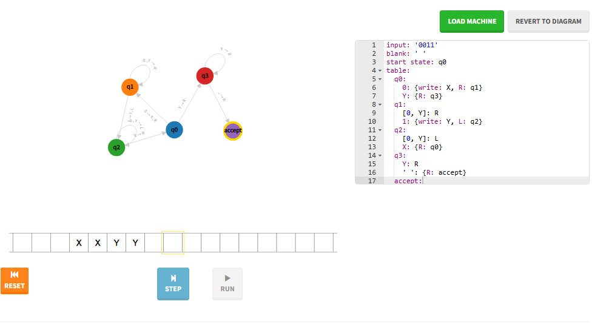
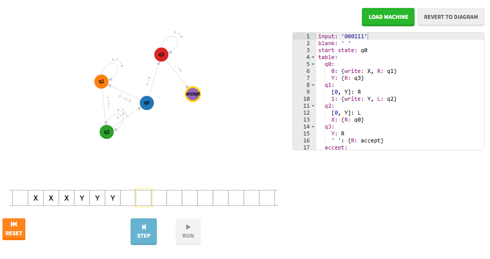
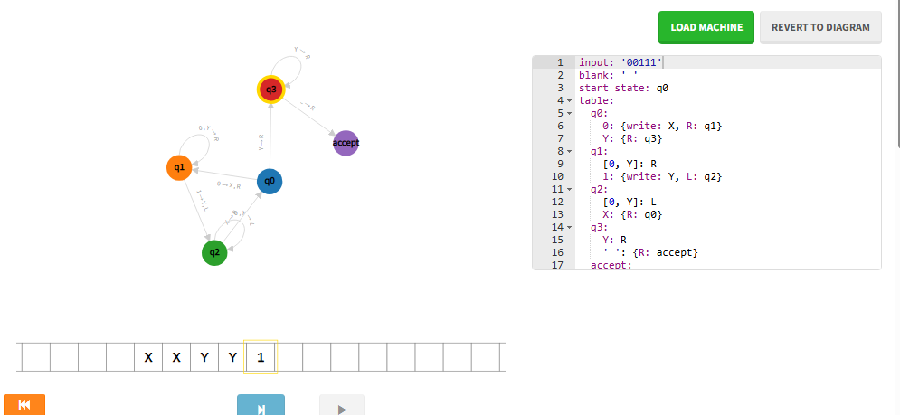

# Máquinas de Turing

**Aluno:** Gabriel Lima Almeida
**Curso:** Engenharia de Software
**Disciplina:** Inteligência Artificial Linguagens Formais e Automatos

---

## Etapa 1: Introdução

**1. O que é uma Máquina de Turing?**
É um modelo teórico que o Turing criou em 1936 pra definir o que é "computar". A ideia veio da máquina de escrever: uma fita infinita, uma cabeça que lê e escreve um símbolo por vez e regras fixas dizendo o que fazer. Não existe fisicamente, mas descreve tudo o que um computador consegue fazer.

**2. Quais são os principais componentes de uma Máquina de Turing?**
- **Fita:** memória infinita dividida em células, com um símbolo em cada.
- **Cabeça de leitura/escrita:** lê, escreve e anda uma casa pra esquerda ou direita.
- **Alfabeto:** os símbolos que a máquina usa, incluindo o branco.
- **Estados:** conjunto finito, com um inicial e os de parada.
- **Regras de transição:** dado o estado e o símbolo lido, dizem o que escrever, pra onde mover e qual o próximo estado.

**3. Qual é a importância das Máquinas de Turing para a computação?**
Ela definiu com rigor o que é um programa e o que é computável. Com a Máquina Universal, que simula qualquer outra máquina, surgiu a ideia do computador moderno: programa e dados no mesmo lugar. Por isso, como o Akita explica no vídeo, Babbage e ENIAC eram só calculadoras grandes. O Von Neumann depois transformou essa teoria em hardware.

**4. Qual é a relação entre Máquina de Turing e algoritmo?**
A Máquina de Turing é a formalização de algoritmo: se uma máquina de Turing resolve o problema, existe algoritmo pra ele.

---

## Etapa 2: Simulação

Simulador utilizado: [Turing Machine Visualization](https://turingmachine.io/), o mesmo apresentado no vídeo do Akita.

Código da máquina: [0n1n.yaml](0n1n.yaml)

```yaml
input: '0011'
blank: ' '
start state: q0
table:
  q0:
    0: {write: X, R: q1}
    Y: {R: q3}
  q1:
    [0, Y]: R
    1: {write: Y, L: q2}
  q2:
    [0, Y]: L
    X: {R: q0}
  q3:
    Y: R
    ' ': {R: accept}
  accept:
```

### Descrição da Máquina de Turing criada

A máquina reconhece palavras da forma 0ⁿ1ⁿ marcando os pares de 0 e 1. Em q0, ela troca o 0 mais à esquerda por X e vai pra direita (q1), passando por cima dos 0s e Ys até achar um 1. Troca esse 1 por Y e volta pra esquerda (q2) até o X, recomeçando em q0. Quando q0 encontra Y em vez de 0, os 0s acabaram, e q3 confere se só sobraram Ys até o branco. Se sim, vai pra `accept` e aceita. Se sobrar 0 ou 1, ou faltar símbolo de um dos lados, ela para sem regra e rejeita.

### Tabela de transições

| Estado | Lê | Escreve | Move | Próximo |
|---|---|---|---|---|
| q0 | 0 | X | → | q1 |
| q0 | Y | Y | → | q3 |
| q1 | 0 | 0 | → | q1 |
| q1 | Y | Y | → | q1 |
| q1 | 1 | Y | ← | q2 |
| q2 | 0 | 0 | ← | q2 |
| q2 | Y | Y | ← | q2 |
| q2 | X | X | → | q0 |
| q3 | Y | Y | → | q3 |
| q3 | branco | branco | → | accept |

Qualquer situação sem regra faz a máquina parar sem aceitar, ou seja, rejeita.

---

## Etapa 3: Registro da simulação

| Teste | Entrada | Resultado esperado | Resultado obtido | Estados percorridos |
|---|---|---|---|---|
| 1 | 0011 | ACEITA | ACEITA (fita final: XXYY) | q0 → q1 → q1 → q2 → q2 → q0 → q1 → q1 → q2 → q2 → q0 → q3 → q3 → accept |
| 2 | 000111 | ACEITA | ACEITA (fita final: XXXYYY) | (q0 → q1 → q1 → q1 → q2 → q2 → q2) repetido 3 vezes, depois q0 → q3 → q3 → q3 → accept |
| 3 | 00111 | REJEITA | REJEITA (fita final: XXYY1) | q0 → q1 → q1 → q2 → q2 → q0 → q1 → q1 → q2 → q2 → q0 → q3 → q3, para ao ler 1 em q3 (sem regra) |

### Teste 1: entrada 0011 (ACEITA)


### Teste 2: entrada 000111 (ACEITA)


### Teste 3: entrada 00111 (REJEITA)


---

## Etapa 4: Reflexão sobre os limites computacionais

Não. Uma Máquina de Turing resolve só o que é computável, e nem tudo é. O exemplo clássico é o Problema da Parada: não existe programa que diga, pra qualquer programa e entrada, se ele termina ou fica em loop pra sempre. Se existisse, dava pra criar um programa que o contradiz, o que é um absurdo. Então o limite não é falta de tecnologia ou memória, é lógico.

---

## Questão final

Primeiro separo "difícil" de "impossível". Difícil tem algoritmo, só que gasta muito tempo ou memória. Impossível não tem máquina de Turing que resolva todos os casos, por mais recursos que tenha. Pra descobrir qual é, tento uma redução: se resolver meu problema permitisse resolver um já provado impossível, como o da Parada, então ele também é impossível. Se eu conseguir construir uma máquina que sempre para com a resposta certa, é só difícil.
